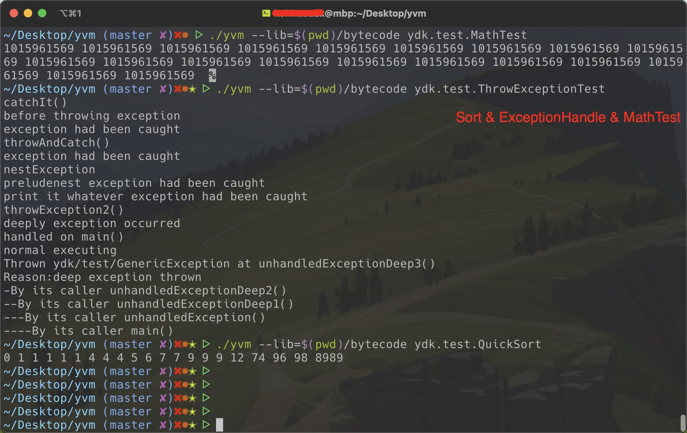

# YVM
# 简介

> [中文](./README.ZH.md) | [English](./README.md)

YVM是用C++写的一个玩具Java虚拟机，现在支持Java大部分功能，以及一个基于标记清除算法的并发垃圾回收器。YVM的实现遵守[Java虚拟机规范 8](https://docs.oracle.com/javase/specs/jvms/se8/jvms8.pdf)。时间有限没有为所有组件补充测试，另外Java语言的特性并没有完全覆盖，但是目前足够让我开心了，就这样了。如果你发现了bug，或者感兴趣想参与，请直接开Issue反馈或者提Pull Request贡献代码，谢谢。

# 构建和运行
```bash
# Note, C++14 is required at least.
$ cd yvm
$ cmake .
$ make
$ ./yvm
Usage:
  yvm --lib=<path> <main_class>

      --lib=<path>     Tells YVM where to find JDK classes(java.lang.String, etc)
      <main_class>     The full qualified Java class name, e.g. org.example.Foo
$ ./yvm --lib=/path/to/yvm/bytecode ydk.test.QuickSort
0 1 1 1 1 1 4 4 4 5 6 7 7 9 9 9 12 74 96 98 8989 
```

# 已实现特性
高级特性逐步支持中，可以开Issue提议或者直接PR。已实现的预言特性主要有下面这些：
+ Java基本算术运算，流程控制语句，面向对象。
+ [RTTI](./javaclass/ydk/test/InstanceofTest.java)
+ [字符串拼接(+,+=符号重载)](./javaclass/ydk/test/StringConcatenation.java)
+ [异常处理(可输出stacktrace)](./javaclass/ydk/test/ThrowExceptionTest.java)
+ [创建异步线程](./javaclass/ydk/test/CreateAsyncThreadsTest.java)
+ [Synchronized(支持对象锁)](./javaclass/ydk/test/SynchronizedBlockTest.java)
+ [垃圾回收(标记清除算法)](./javaclass/ydk/test/GCTest.java)



示例Java小程序参见[here](javaclass/ydk/test/).

# Hacking指南!
## 1. 工作原理
1. `loadJavaClass("org.example.Foo")`
    - findJavaClass查找已加载的类
    - 查找失败，则从--lib路径加载，加载后存放到MethodArea
2. `linkJavaClass("org.example.Foo")`
    - 默认值初始化static字段
3. `initJavaClass("org.example.Foo")`
    - Invoke `org.example.Foo.<clinit>`
4. `invokeByName("org.example.Foo","main","([Ljava/lang/String;)V")`
    - 初始化执行栈
    - 从JavaClass查找main方法
    - `execByteCodede`
        - 在模拟的栈上解释执行字节码
        - 如果遇到`invoke*`系列字节码，则递归调用`execByteCode`

## 2. 代码结构
```bash
root@ubuntu:~/yvm/src$ tree .
.
├── classfile               
│   ├── AccessFlag.h        # 类，字段，方法的访问标志
│   ├── ClassFile.h         # .class字节码对应的结构体
│   └── FileReader.h          # 读取.class文件
├── gc
│   ├── Concurrent.cpp      # 并发组件
│   ├── Concurrent.hpp
│   ├── GC.cpp              # 垃圾回收
│   └── GC.h
├── interpreter
│   ├── CallSite.cpp        # 调用点对象，描述具体的调用
│   ├── CallSite.h
│   ├── Internal.h          # 虚拟机内部通用类型
│   ├── Interpreter.cpp     # 代码执行引擎
│   ├── Interpreter.hpp
│   ├── MethodResolve.cpp   # 调用方法解析
│   └── MethodResolve.h
├── misc
│   ├── Debug.cpp            # 调试组件
│   ├── Debug.h
│   ├── NativeMethod.cpp    # Java native方法实现
│   ├── NativeMethod.h
│   ├── Option.h            # 参数和配置
│   ├── Utils.cpp           # 工具组件
│   └── Utils.h
├── runtime
│   ├── JavaClass.cpp       # 虚拟机中的类表示
│   ├── JavaClass.h
│   ├── JavaException.cpp   # 异常处理
│   ├── JavaException.h
│   ├── JavaFrame.cpp       # 运行时栈帧
│   ├── JavaFrame.hpp
│   ├── JavaHeap.cpp        # 虚拟机堆，管理对象
│   ├── JavaHeap.hpp
│   ├── JavaType.h          # 虚拟机中的Java类表示
│   ├── MethodArea.cpp      # 方法区，管理JavaClass
│   ├── MethodArea.h
│   ├── ObjectMonitor.cpp   # synchronized语义实现
│   ├── ObjectMonitor.h
│   ├── RuntimeEnv.cpp      # 运行时结构定义
│   └── RuntimeEnv.h
└── vm
    ├── Main.cpp             # 命令行解析
    ├── YVM.cpp              # 虚拟机抽象。
    └── YVM.h
```
Wiki和源码中有很多详细的开发文档，如果想探索关于`YVM`的更多内容，请移步浏览.

# 开源协议
所有代码基于[MIT](./LICENSE)协议
