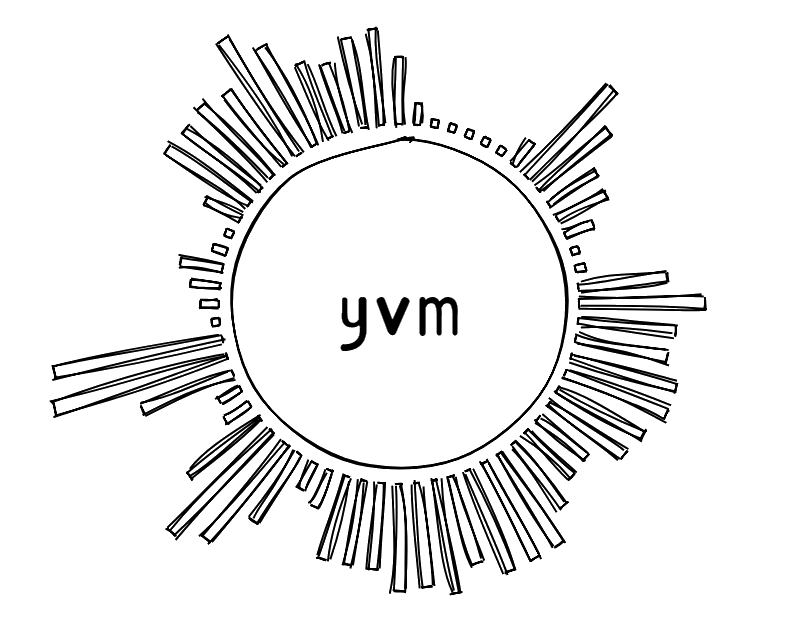

 <p align="center"></p>

[中文](https://github.com/racaljk/yvm/blob/master/README.ZH.md) | [English](https://github.com/racaljk/yvm/blob/master/README.md)
| [](https://travis-ci.org/racaljk/yvm) | [](https://www.codacy.com/app/racaljk/yvm?utm_source=github.com&amp;utm_medium=referral&amp;utm_content=racaljk/yvm&amp;utm_campaign=Badge_Grade) |  | 


This is a homemade Java virtual machine written in c++, it supports most Java language features and includes a mark-sweep-based concurrent garbage collector. The main components of this VM are conforming to [Java Virtual Machine Specification 8](https://docs.oracle.com/javase/specs/jvms/se8/jvms8.pdf). It is runnable and various language features will add into this VM progressively. I don't have enough time to write a full coverage unit tests to ensure that all aspects of yvm work well, so if you find any bugs, you can open an [Issue](https://github.com/racaljk/yvm/issues/new) or fix up in place and pull request directly.

# Available language features
Advanced language features will support later, you can also PR to contribute your awesome code.
+ Java arithmetic, flow control, object-oriented programming(virtual method, inherit,etc.)
+ [Runtime type identification](./javaclass/ydk/test/InstanceofTest.java)
+ [String concatenation](./javaclass/ydk/test/StringConcatenation.java)
+ [Exception handling](./javaclass/ydk/test/ThrowExceptionTest.java)
+ [Async native threads](./javaclass/ydk/test/CreateAsyncThreadsTest.java)
+ [Synchronized block with object lock](./javaclass/ydk/test/SynchronizedBlockTest.java)
+ [Garbage Collection(With mark-and-sweep policy)](./javaclass/ydk/test/GCTest.java)

# Build and run
+ Prerequisite
  + [Boost](https://www.boost.org/)(>=1.65) Please set Boost root directory in `CMakeLists.txt` manually if automatic cmake detecting failed
  + C++14
  + gcc/msvc/mingw
+ Stereotype
```bash
$ cd yvm
$ cmake .
$ make -j4
$ make test
```
```bash
$ ./yvm --help
Usage:
  --help                List help documentations and usages.
  --runtime arg         Attach java runtime libraries where yvm would lookup 
                        classes at
  --run arg             Program which would be executed soon
You must specify the "runtime" flag to tell yvm where it could find jdk classes, and also program name is required.
$ ./yvm --runtime=C:\Users\Cthulhu\Desktop\yvm\bytecode ydk.test.QuickSort
```

# Running snapshots
+ helloworld


+ quick sort


+ print stack trace when exception occurred


+ native multithreading


+ multithreading with synchronized(){}


+ Garbage Collection


# Developing and hacking
<details>
<summary>1. From bytecode to an object </summary>

`MethodArea` used to handle a complete lifecycle of JavaClass, its APIs are self-explanatory:
```cpp
class MethodArea {
public:
    // Pass runtime libraries paths to tell virutal machine searches 
    // where to lookup dependent classes
    MethodArea(const vector<string>& libPaths);
    ~MethodArea();

    // check whether it already exists or absents
    JavaClass* findJavaClass(const string& jcName);
    // load class which specified by jcName
    bool loadJavaClass(const string& jcName);
    // remove class which specified by jcName（Used for gc only）
    bool removeJavaClass(const string& jcName);
    // link class which specified by jcName，initialize its fields
    void linkJavaClass(const string& jcName);
    // initialize class specified by jcName，call the static{} block
    void initJavaClass(Interpreter& exec, const string& jcName);

public:
    //auxiliary functions
    JavaClass* loadClassIfAbsent(const string& jcName);
    void linkClassIfAbsent(const string& jcName);
    void initClassIfAbsent(Interpreter& exec, const string& jcName);
}
```
For example, we have a bytecode file named `Test.class`，it would be available for jvm only if the following steps finished：

`Test.class[in the disk]`-> `loadJavaClass("Test.class")[in memory]` -> `linkJavaClass("Test.class")`->`initJavaClass("Test.class")`

Now we can create corresponding objects as soon as above steps accomplished：
```cpp
// yrt is a global runtime variable，ma stands for MethodArea module,jheap stands for JavaHeap module
JavaClass* testClass = yrt.ma->findJavaClass("Test.class");
JObject* testInstance = yrt.jheap->createObject(*testClass);
```
</details>
<details>
<summary>2.1 Inside the object</summary>

jvm stack only holds basic numeric data and object/array reference, which we call the JObject/JArray, they have the following structure:
```cpp
struct JObject {
    std::size_t offset = 0; 
    const JavaClass* jc{}; 
};
```
`offset` stands for an object，all operations of object in heap required this `offset`。`jc` references to the JavaClass。
Every object in heap constructed with <offset, fields> pair
```
[1]  ->  [field_a, field_b, field_c]
[2]  ->  []
[3]  ->  [field_a,field_b]
[4]  ->  [field_a]
[..] ->  [...]
```
If we get the object's offset, we can do anything of that indirectly.

Array is almost the same as object, it has a length field instead of jc since it's unnecessary for array to hold a meta class reference.
```cpp
struct JArray {
    int length = 0;
    std::size_t offset = 0; 
};
[1]  ->   <3, [field_a, field_b, field_c]>
[2]  ->   <0, []>
[3]  ->   <2, [field_a,field_b]>
[4]  ->   <1, [field_a]>
[..] ->   <..,[...]>
```
</details>
<details>
<summary>2.2 From object creation to extinction</summary>

As above mentioned, a JObject holds`offset` and `jc`. `MethodArea` has responsible to manage `JavaClass` which referenced by `jc`, another `offset` field referenced to `JObject`, which in control of `JavaHeap`. `JavaHeap` provides a large number of self-explanatory APIs:
```cpp
class JavaHeap {
public:
    // create and object/array
    JObject* createObject(const JavaClass& javaClass);
    JArray* createObjectArray(const JavaClass& jc, int length);

    // get/set field
    auto getFieldByName(const JavaClass* jc, const string& name,
                        const string& descriptor, JObject* object);
    void putFieldByName(const JavaClass* jc, const string& name,
                        const string& descriptor, JObject* object,
                        JType* value);
    // get/set specific element in the array
    void putElement(const JArray& array, size_t index, JType* value);
    auto getElement(const JArray& array, size_t index);
    
    // remove an array/object from heap
    void removeArray(size_t offset;
    void removeObject(size_t offset);
};
```
Back to the above example again, assume its corresponding Java class structure is as follows:
```java
public class Test{
    public int k;
    private String hello;
}
```
In the first step, we've already got `testClass`, now we can do more things via it:
```cpp
const JavaClass* testClass = yrt.ma->findJavaClass("Test.class");
JObject* testInstance = yrt.jheap->createObject(*testClass);
// get the field hello
JObject*  helloField = yrt.jheap->getFieldByName(testClass,"hello","Ljava/lang/String;",testInstance);
//set the field k
yrt.jheap->putFieldByName(testClass,"k","I",testInstance);
```
</details>
<details>
<summary>Ⅰ. About JDK</summary>

Any java virtual machines can not run a Java program without Java libraries. As you may know, some opcodes like `ldc`,`monitorenter/monitorexit`,`athrow` are internally requiring our virtual machine to operate JDK classes(`java.lang.Class`,`java.lang.String`,`java.lang.Throwable`,etc). Hence, I have to rewrite some [JDK classes](./javaclass) for building a runnable VM , because original JDK classes are so complicated that it's inconvenient for early developing.
Rewrote JDK classes are as follows:
+ `java.lang.String`
+ `java.lang.StringBuilder`
+ `java.lang.Throwable`
+ `java.lang.Math(::random())`
+ `java.lang.Runnable`
+ `java.lang.Thread`
</details>

<details> 
<summary> II. Structure of source code </summary>

```bash
racaljk@ubuntu:~/yvm/src$ tree .
.
├── classfile               
│   ├── AccessFlag.h        # Access flag of class, method, field
│   ├── ClassFile.h         # Corresponding structures for .class file
│   └── FileReader.h        # Read .class file
├── gc
│   ├── Concurrent.cpp      # Concurrency utilities
│   ├── Concurrent.hpp
│   ├── GC.cpp              # Garbage collector
│   └── GC.h
├── interpreter
│   ├── CallSite.cpp        # Call site to denote a concrete calling
│   ├── CallSite.h
│   ├── Internal.h          # Types that widely used within internal vm
│   ├── Interpreter.cpp     # Interprete opcode
│   ├── Interpreter.hpp
│   ├── MethodResolve.cpp   # Resolve calling memthod
│   └── MethodResolve.h
├── misc
│   ├── Debug.cpp            # Debuggin utilities
│   ├── Debug.h
│   ├── NativeMethod.cpp    # Implementations of java native methods
│   ├── NativeMethod.h
│   ├── Option.h            # VM arguments and options
│   ├── Utils.cpp           # Tools and utilities
│   └── Utils.h
├── runtime
│   ├── JavaClass.cpp       # Representation of java class
│   ├── JavaClass.h
│   ├── JavaException.cpp   # Exception handling
│   ├── JavaException.h
│   ├── JavaFrame.cpp       # Runtime frame
│   ├── JavaFrame.hpp
│   ├── JavaHeap.cpp        # Runtime heap, used to manage objects and arrays
│   ├── JavaHeap.hpp
│   ├── JavaType.h          # Java primitive types and reference type definitions
│   ├── MethodArea.cpp      # Method area has responsible to manage JavaClass objects
│   ├── MethodArea.h
│   ├── ObjectMonitor.cpp   # synchronized syntax implementation
│   ├── ObjectMonitor.h
│   ├── RuntimeEnv.cpp      # Definitions of runtime structures
│   └── RuntimeEnv.h
└── vm
    ├── Main.cpp             # Parse command line arguments
    ├── YVM.cpp              # Abstraction of virtual machine
    └── YVM.h

6 directories, 39 files
```
</details>

For more development documentations, see its [Wiki](https://github.com/racaljk/yvm/wiki) or source code comments(recommend), which contains various contents with regard to its structures, usages, and design principles, etc.  

# License
Code licensed under the MIT License.
