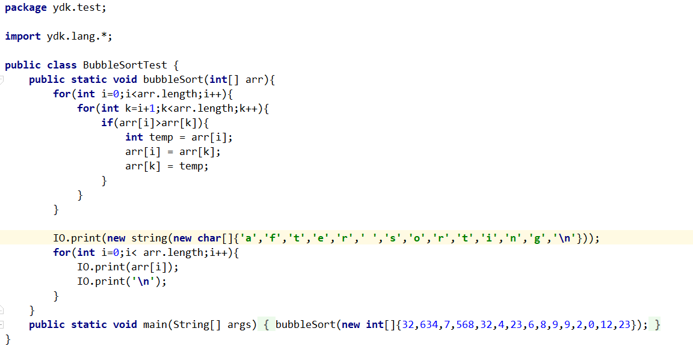
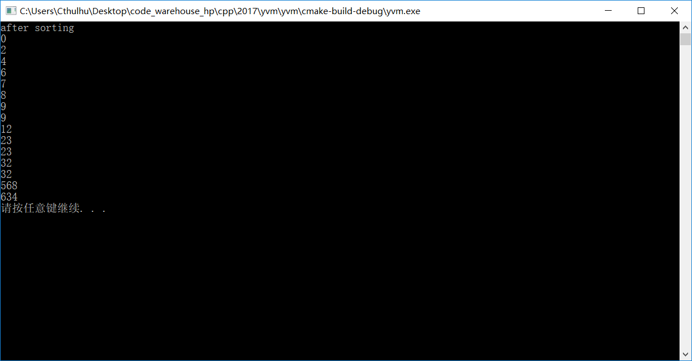

# YVM
这是用C++写的一个虚拟机，现在支持java大部分指令，不过还有很多bug等待修复。
感兴趣的朋友pull request/fork/star吧！

# 使用

1. 配置src/main.cpp
```cpp
#include "YVM.h"

int main() {
    const char * ydk[] = {
    	//该项目library文件所在绝对路径
        R"(C:\Users\Cthulhu\Desktop\yvm\javalib)"
    };

    YVM vm;
    vm.warmUp(ydk, sizeof(ydk) / sizeof(ydk[0]));
    vm.callMain("ydk/test/InheritanceTest");
    system("pause");
    return 0;
}
```
2. 支持G++7.0,MSVC 2017,直接编译运行即可

# 支持特性
0. Java基本算数运算，面向对象
1. 字符串常量运算(+,+=)

# 效果
0. helloworld


1. 冒泡排序




# 限制
0. YVM现在不支持JavaSE6及其之前版本编译器编译的`.class`
1. **不能使用任何JDK的方法**,请使用`ydk.lang.*`(如果使用一个jdk方法，基本就得实现大部分jdk库,但仅靠一个人的力量写JDK难如登天，这和我的初衷(造一个可用的娱乐JVM)有悖)

# 公有设计，私有实现
0. 在JVM中`byte`,`char`,`boolean`,`short`都会进行符号扩展至`int`,即JVM实际存在的类型只有`int`,`long`,`float`,`double`,`object ref`,`array`
1. YVM中类只有一种权威表示,即"package/foo/Bar",任何其他表示如"java.lang.Object"都拒绝加载
2. 根据JVMSPEC,虚拟机执行引擎会直接操纵JDK一些类,如`java/lang/Class`,`java/lang/invoke/MethodType`,`java/lang/invoke/MethodHandle`,`java/lang/String`.为了实现一个"Runnable"的JVM，这里使用自建YDK的类代替它们。


# License
Code licensed under the MIT License.