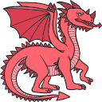
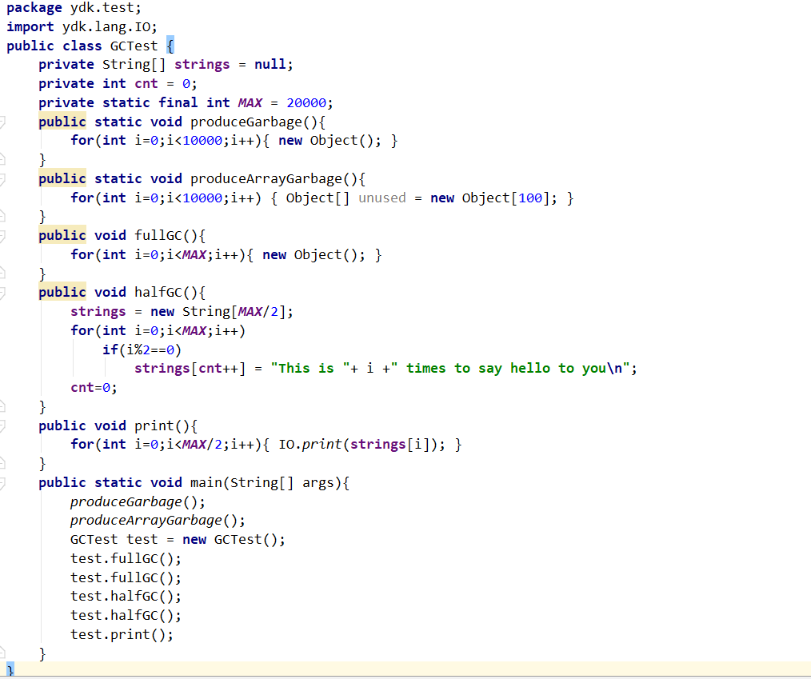

 Yet another java Virtual Machine

[中文](https://github.com/racaljk/yvm/blob/master/README.md) | [English](https://github.com/racaljk/yvm/blob/master/README.EN.md)
| [](https://travis-ci.org/racaljk/yvm) |  | 

YVM是用C++写的一个Java虚拟机，现在支持Java大部分功能，以及一个基于标记清除算法的并发垃圾回收器. 不过还有很多bug等待修复。
感兴趣的朋友pull request/fork/star吧。

# 已支持语言特性
高级特性逐步支持中，可以开Issue提议或者直接PR
+ Java基本算术运算，流程控制语句，面向对象。
+ [RTTI](./javaclass/ydk/test/InstanceofTest.java)
+ [字符串拼接(+,+=符号重载)](./javaclass/ydk/test/StringConcatenation.java)
+ [异常处理(可输出stacktrace)](./javaclass/ydk/test/ThrowExceptionTest.java)
+ [创建异步线程](./javaclass/ydk/test/CreateAsyncThreadsTest.java)
+ [Synchronized(支持对象锁)](./javaclass/ydk/test/SynchronizedBlockTest.java)
+ [垃圾回收(标记清除算法)](./javaclass/ydk/test/GCTest.java)

# 构建和运行
+ 先决条件
  + [Boost](https://www.boost.org/)(>=1.65) 请在`CMakeLists.txt`中手动配置Boost库位置
  + CMake(>=3.5)
  + C++14
  + gcc/msvc/mingw均可
+ 老生常谈
```bash
$ cd yvm
$ cmake .
$ make -j4
$ make test
```
```bash
$ ./yvm --help
Usage:
    --help                List help documentations and usages.
    --runtime arg         Attach java runtime libraries where yvm would lookup 
                        classes at
    --run arg             Program which would be executed soon
You must specify the "runtime" flag to tell yvm where it could find jdk classes, and also program name is required.
$ ./yvm --runtime=C:\Users\Cthulhu\Desktop\yvm\bytecode ydk.test.QuickSort
```

# 运行效果
+ helloworld


+ 快速排序


+ 异常调用栈轨迹


+ 原生多线程


+ Synchronized保护下的多线程


+ 垃圾回收



# 开发文档
## 1. 从字节码到对象
`MethodArea`负责管理字节码到JavaClass的完整生命周期。`MethodArea`的方法是自解释的：
```cpp
class MethodArea {
public:
    // 方法区需要从运行时目录中搜索相关的*.class文件
    MethodArea(const vector<string>& libPaths);
    ~MethodArea();

    // 查看一个类是否存在
    JavaClass* findJavaClass(const string& jcName);
    //加载jcName类
    bool loadJavaClass(const string& jcName);
    //移除jcName（该方法用于垃圾回收器）
    bool removeJavaClass(const string& jcName);
    //链接jcName类，初始化static字段
    void linkJavaClass(const string& jcName);
    //初始化jcName，初始化静态字段，调用static{}
    void initJavaClass(CodeExecution& exec, const string& jcName);

public:
    //辅助方法，如果不存在jcName则加载 
    JavaClass* loadClassIfAbsent(const string& jcName);
    //如果未链接jcName则链接
    void linkClassIfAbsent(const string& jcName);
    //如果未初始化jcName则初始化
    void initClassIfAbsent(CodeExecution& exec, const string& jcName);
}
```
假设磁盘存在一个`Test.class`文件，它会经历如下过程：

`Test.class[磁盘中]`-> `loadJavaClass("Test.class")[内存中]` -> `linkJavaClass("Test.class")`->`initJavaClass("Test.class")`

现在虚拟机就可以使用这个JavaClass创建对应的对象了：
```cpp
// yrt 是全局运行时对象，ma表示方法区模块,jheap表示堆模块
JavaClass* testClass = yrt.ma->findJavaClass("Test.class");
JObject* testInstance = yrt.jheap->createObject(*testClass);
```
## 2.1 对象内部构造
虚拟机执行时栈上存放的都是JObject,它的结构如下：
```cpp
struct JObject {
    std::size_t offset = 0; 
    const JavaClass* jc{}; 
};
```
`offset`唯一代表一个对象，所有在堆上面的操作都需要这个offset。`jc`指向对象的Class表示。
堆中的对象是按照<offset,fields>方式进行存放的：
```
[1]  ->  [field_a, field_b, field_c]
[2]  ->  []
[3]  ->  [field_a,field_b]
[4]  ->  [field_a]
[..] ->  [...]
```
只要我们持有offset，就可以查找/添加/删除对应的field

数组几乎和上面类似,只是多了长度，少了Class指针
```cpp
struct JArray {
    int length = 0;
    std::size_t offset = 0; 
};
[1]  ->   <3, [field_a, field_b, field_c]>
[2]  ->   <0, []>
[3]  ->   <2, [field_a,field_b]>
[4]  ->   <1, [field_a]>
[..] ->   <..,[...]>
```
## 2.2 从对象创建到消亡
上面提到，对象持有一个offset和jc，其中jc表示的JavaClass是由`MethodArea`负责管理的，offset则是由`JavaHeap`负责管理。`JavaHeap`提供了大量API，这里选取的是最重要的:
```cpp
class JavaHeap {
public:
    //创建对象和数组
    JObject* createObject(const JavaClass& javaClass);
    JArray* createObjectArray(const JavaClass& jc, int length);

    //获取对象字段
    auto getFieldByName(const JavaClass* jc, const string& name,
                        const string& descriptor, JObject* object);
    //设置对象字段
    void putFieldByName(const JavaClass* jc, const string& name,
                        const string& descriptor, JObject* object,
                        JType* value);
    //设置数组元素
    void putElement(const JArray& array, size_t index, JType* value);
    //获取数组元素
    auto getElement(const JArray& array, size_t index);
    
    //移除对象和数组
    void removeArray(size_t offset;
    void removeObject(size_t offset);
};
```
还是`Test.class`那个例子，假设对应的`Test.java`构造如下:
```java
public class Test{
    public int k;
    private String hello;
}
```
在第一步我们已经获取到了Test类在虚拟机中的类表示以及对象表示,现在就可以对类的字段进行操作了：
```cpp
const JavaClass* testClass = yrt.ma->findJavaClass("Test.class");
JObject* testInstance = yrt.jheap->createObject(*testClass);
//获取hello字段
JObject*  helloField = yrt.jheap->getFieldByName(testClass,"hello","Ljava/lang/String;",testInstance);
//设置k字段
yrt.jheap->putFieldByName(testClass,"k","I",testInstance);
```

## Ⅰ. 关于JDK
部分JDK类是JVM运行攸关的,但由于JDK比较复杂不便于初期开发,所以这里用重写过的JDK代替,源码参见[javaclass](./javaclass)目录,可以使用`compilejava.bat`进行编译，编译后`*.class`文件位于[bytecode](./bytecode).
目前重写过的JDK类有:
+ `java.lang.String`
+ `java.lang.StringBuilder`
+ `java.lang.Throwable`
+ `java.lang.Math(::random())`
+ `java.lang.Runnable`
+ `java.lang.Thread`

[Wiki](https://github.com/racaljk/yvm/wiki)和源码中有很多详细的开发文档，如果想探索关于`YVM`的更多内容，请移步浏览.

# License
Code licensed under the MIT License.
